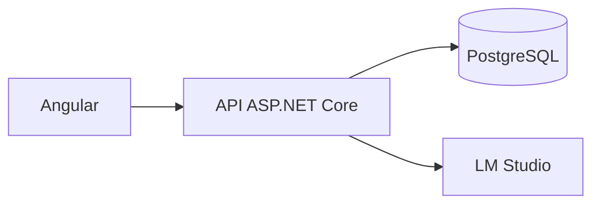

# App Finanzas Hogar

Aplicación para registrar ingresos y gastos, consultar el balance del hogar y explorar los movimientos con ayuda de un asistente de IA local. El proyecto separa una API REST en ASP.NET Core de una interfaz en Angular; PostgreSQL almacena los datos y LM Studio ejecuta el modelo de lenguaje en el equipo del usuario.

## Funcionalidades

- Registro e inicio de sesión con ASP.NET Core Identity y tokens JWT. Roles `User` y `Admin` inicializados en el backend.
- CRUD de movimientos y categorías. Los movimientos del usuario se consultan mediante la API autenticada.
- Filtros de movimientos por fechas, tipo, categoría y texto.
- Resumen mensual, resumen de un período, totales por categoría y evolución mensual de ingresos, gastos y balance.
- Interfaz Angular con rutas protegidas, formulario reactivo de movimientos, filtros y vistas de resumen.
- Asistente IA que interpreta preguntas sobre los datos financieros y responde a partir de consultas controladas por el backend. Si no hay datos suficientes, debe indicarlo sin inventar cifras.
- Documentación interactiva de la API mediante Scalar.

## Tecnologías y arquitectura

| Capa | Tecnología |
|---|---|
| Interfaz | Angular con componentes standalone, formularios reactivos y HttpClient |
| API | ASP.NET Core, C# y Entity Framework Core |
| Autenticación | ASP.NET Core Identity y JWT |
| Persistencia | PostgreSQL con Npgsql |
| Asistente local | LM Studio y modelo Qwen 2.5 Instruct mediante API compatible con OpenAI |
| Documentación de API | Scalar |



La API recibe la identidad del usuario desde el token y ejecuta las consultas a sus movimientos. El modelo no se conecta directamente a PostgreSQL ni recibe el identificador del usuario. Las operaciones que el asistente usa para consultar datos son de solo lectura.

## Organización del proyecto

La parte frontend usa esta estructura:

```text
front/
├── openspec/          # Especificaciones y cambios del frontend
├── ...                # Configuración de OpenCode
└── app_Fh_front/      # Proyecto Angular; aquí se ejecuta npm
```

El backend es un proyecto ASP.NET Core independiente. Consulta el archivo `.sln` o `.csproj` de tu copia para localizar su directorio exacto. La interfaz consume la API mediante HTTP; en desarrollo se ha configurado el backend en `http://localhost:5240` y un proxy de Angular para las solicitudes `/api`.

## Modelo de datos

Un movimiento incluye `id`, `cantidad` (decimal positiva), `fecha` (`DateOnly`), `descripcion` (máximo 250 caracteres), `categoriaId`, `tipo` y `usuarioId`.

`tipo` distingue:

- `Ingreso = 1`
- `Egreso = 2`

Una categoría incluye `id`, `nombre` y `tipo`.

Al crear un movimiento se envían `cantidad`, `fecha`, `categoriaId` y, opcionalmente, `descripcion`. La API asigna el movimiento al usuario autenticado. Para las categorías se recomienda mantener coherente su tipo con el tipo de movimiento.

## API

Salvo registro e inicio de sesión, los endpoints requieren autenticación con `Authorization: Bearer <token>`.

| Método | Ruta | Uso |
|---|---|---|
| `POST` | `/api/Auth/register` | Registrar usuario (nombre, apellido, email, password) |
| `POST` | `/api/Auth/login` | Iniciar sesión (email, password); devuelve token |
| `GET` | `/api/Movimientos` | Listar y filtrar por `fechaDesde`, `fechaHasta`, `tipo`, `categoriaId` y `texto` |
| `GET` | `/api/Movimientos/{id}` | Consultar un movimiento |
| `POST` | `/api/Movimientos` | Crear un movimiento |
| `PUT` | `/api/Movimientos/{id}` | Actualizar un movimiento |
| `DELETE` | `/api/Movimientos/{id}` | Eliminar un movimiento |
| `GET` | `/api/Movimientos/resumen-mensual` | Resumen con mes y anio |
| `GET` | `/api/Movimientos/resumen-por-categoria` | Totales por categoría; `fechaDesde`, `fechaHasta` y `tipo` opcionales |
| `GET` | `/api/Movimientos/evolucion-mensual` | `anio`, `mes`, `ingresos`, `gastos` y `balance` por mes; requiere `fechaDesde` y `fechaHasta` |
| `GET` | `/api/Movimientos/resumen-periodo` | `fechaDesde`, `fechaHasta`, `ingresos`, `gastos` y `balance` |
| `GET` | `/api/Categorias` | Listar categorías, ordenadas por tipo y nombre |
| `GET` | `/api/Categorias/{id}` | Consultar una categoría |
| `POST` | `/api/Categorias` | Crear una categoría |
| `PUT` | `/api/Categorias/{id}` | Actualizar una categoría |
| `DELETE` | `/api/Categorias/{id}` | Eliminar una categoría |
| `POST` | `/api/Asistente/chat` | Consultar al asistente en lenguaje natural |

El resumen por categoría devuelve `categoriaId`, `categoriaNombre`, `tipo` y `total`. El endpoint de evolución y los resúmenes permiten construir gráficos sin calcular agregados en el navegador. Para el cuerpo exacto de las solicitudes y respuestas, consulta Scalar en la instancia de la API.

## Interfaz Angular

| Ruta | Función |
|---|---|
| `/login` | Inicio de sesión |
| `/register` | Registro |
| `/home` | Página principal y acceso a las operaciones |
| `/movimientos` | Listado, filtros y resumen |
| `/movimientos/nuevo` | Creación de un movimiento |

Las rutas privadas usan un guard de autenticación. El token se conserva en `sessionStorage` y un interceptor añade el encabezado Bearer a las llamadas `/api`. El formulario valida cantidad positiva, fecha y categoría obligatorias y descripción de hasta 250 caracteres; presenta estados de carga, vacío y error. La pantalla de movimientos consume los datos de la API sin filtrar usuarios en el cliente.

## Puesta en marcha local

Requisitos: PostgreSQL, el SDK de .NET correspondiente al `TargetFramework` del proyecto, Node.js y npm. Para usar el asistente también necesitas LM Studio y un modelo local cargado. El backend se ha trabajado con un proyecto `net10.0`: comprueba el `.csproj` antes de elegir el SDK.

1. Configura PostgreSQL y la cadena de conexión que espera la API en su configuración local. No incluyas credenciales reales en el repositorio.

2. En el directorio del proyecto backend, restaura dependencias y aplica las migraciones de EF Core existentes:

   ```bash
   dotnet restore
   dotnet ef database update
   dotnet run
   ```

   En el entorno de desarrollo utilizado, la API escucha en `http://localhost:5240`. Revisa `launchSettings.json` si tu instalación usa otro puerto.

3. Para las funciones de IA, inicia LM Studio, carga el modelo configurado y habilita su servidor compatible con OpenAI en `http://localhost:1234/v1/chat/completions`. Durante el desarrollo se ha usado `qwen2.5-1.5b-instruct` en cuantización `Q4_K_M`; el identificador exacto configurado en la API debe coincidir con el modelo cargado.

4. Inicia Angular desde `front/app_Fh_front/`:

   ```bash
   cd front/app_Fh_front
   npm install
   npm start
   ```

   Comprueba que el proxy de desarrollo apunta a `http://localhost:5240` para las llamadas `/api`.

El asistente depende de LM Studio; el registro, los movimientos y los resúmenes de la API se pueden usar por separado.

## Comprobación

Desde `front/app_Fh_front/`:

```bash
npm test
npm run build
```

En la última comprobación registrada del cambio de filtros y resumen del frontend se superaron 45 pruebas y la compilación terminó correctamente. Ese resultado corresponde a aquel estado del proyecto; vuelve a ejecutar los comandos tras cambios posteriores, especialmente al integrar la vista del chat.

## Estado y próximos pasos

El backend del asistente ya expone `POST /api/Asistente/chat` y se ha probado con preguntas sobre movimientos concretos y resúmenes, incluyendo meses sin datos. La integración de una vista de chat en Angular, sus estados de carga y error, y la representación gráfica de evolución y categorías figuran como próximos pasos según las últimas conversaciones; no se dan aquí por implementados.